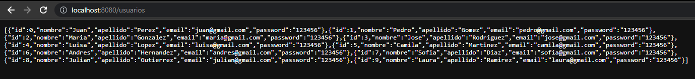
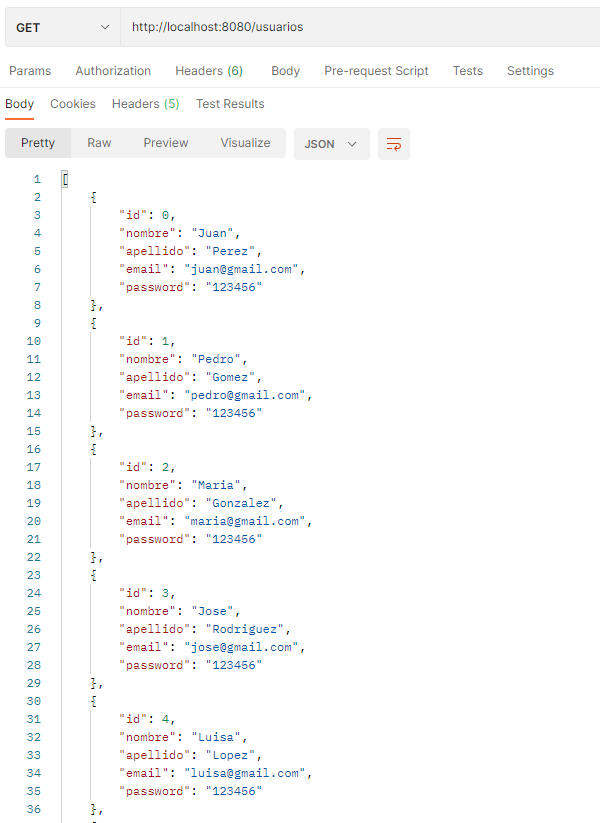
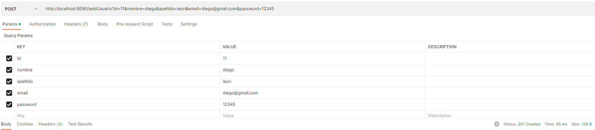
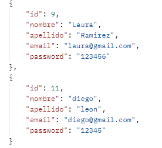
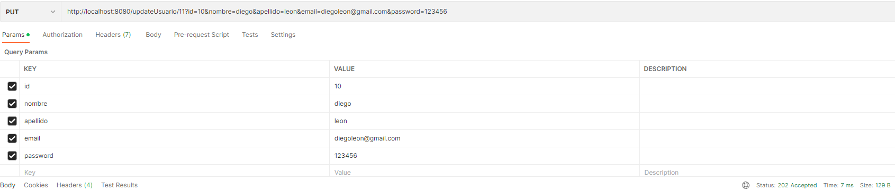
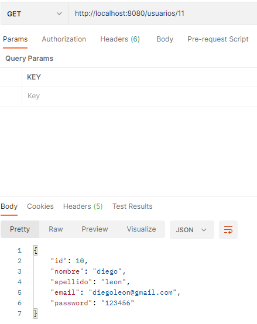
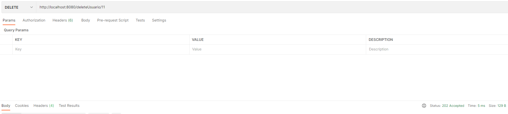
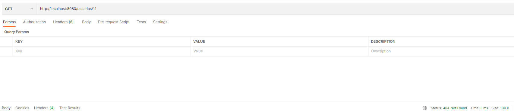

### Escuela Colombiana de Ingeniería

### IETI - Laboratorio 2

####  Implementar el controlador y servicio del API REST

#### Pruebas

- Obtener todos los usuarios

- Obtener un usuario por su id

- Crear un usuario

- Actualizar un usuario

- Eliminar un usuario

### Integrantes:

- Diego Leon
- Jaime Castro
